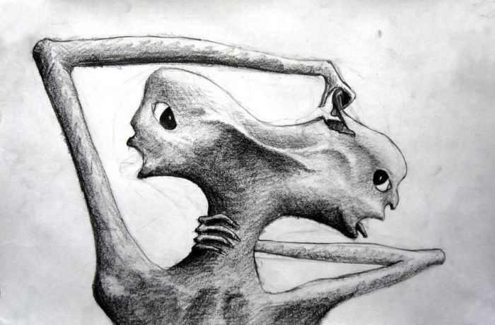
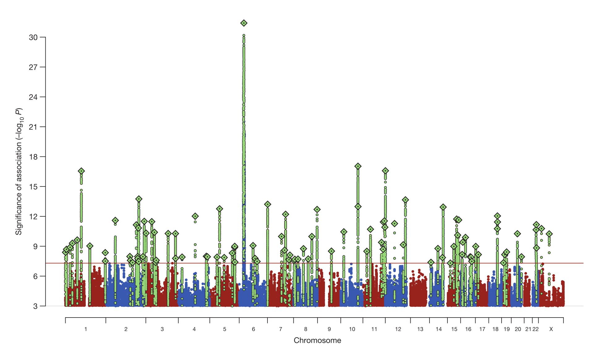
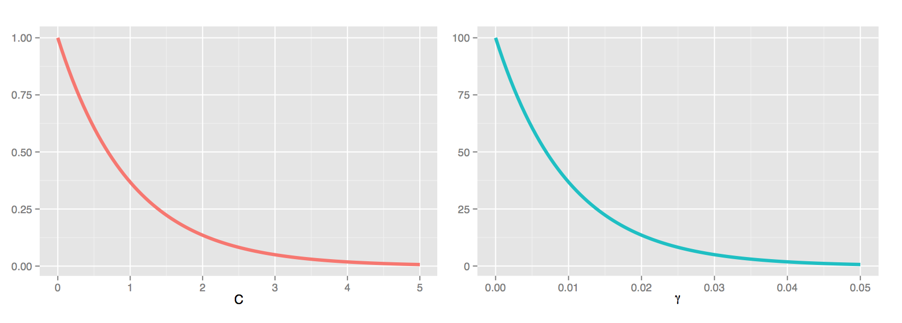

# Using Support Vector Machines in Scikit-Learn to discover genetic aetiologies in Schizophrenia

### ... or how the Scikit-Learn and Pandas devs have done about half of my PhD

* Tim Vivian-Griffiths
* timvg80@gmail.com
* @timvg80

## A personal request


## Schizophrenia

* Debilitating psychiatric condition
    * Lifetime prevalence rate of 0.7-1%
    * Positive Symptoms:
        * Delusional thoughts (paranoid)
        * Hallucinations across senses
    * Negative Symptoms:
        * Lack of emotion (apathy)
        * Anhedonia - inability to experience pleasure

## Artwork by a sufferer



## Genetics of Schizophrenia
* Small cumulative contributions from whole genome ("Polygenic")
* __Common mutations of small effect - Single Nucleotide Polymorphism (SNP)__


* rs4648845 on Chromosome 1:
    * TCAGGCGGGGGCAGGAGCAGT<font color='red'>[C/T]</font>AGAAGCTTCAGAGGAGCGGCC
* Double Stranded DNA:
    * Count per sample {0, 1, 2}
    
Image: https://wp.nyu.edu/genome_diversityspring2015/?p=108

## Genome Wide Association Study (GWAS)

* Examine counts of minor alleles in cases and controls
* Association test (Odds Ratio and p-value from $\chi^{2}$ test)
* __MASSIVE__ need for multiple comparison correction
    * Bonferroni correction (1,000,000) $p=5\times10^{-8}$

### Log-Odds Ratio

$\ln\left(\frac{1}{2}\right) = -\ln(2)$

## Psychiatric Genetics Consortium 2014 (36,989 Cases, 113,075 Controls)
### Ripke et al. _Nature_ Vol 511 p. 421


## Aims of Study
### Treatment Resistant Schizophrenia - Receiving Clozapine medication
#### 3,446 Cases / 4,285 Controls

* Compare performance of Support Vector Machine and traditional scoring methods
    * Polygenic Score
        * Minor allele count {0, 1, 2} weighted by Log Odds Ratio (LOR)
        * Mean of all non-missing values calculated per individual
        * Single _risk_ score per person
        * Logistic Regression      

* Use Linear and non-Linear methods for the Support Vector Machine
    * Polynomial Kernel
    * Radial Basis Function (RBF) Kernel
    
Hamshere et al. _Molecular Psychiatry_ (18), 708-712, 2013     

## Support Vector Machines
### Linearly Separable Data

All images adapted from code at http://scikit-learn.org/stable/auto_examples/svm/plot_svm_kernels.html

## Support Vector Machines
### Linearly Separable Data with Boundaries


* Support Vectors

## Parameter Selection Unclear Data Point
### Unclear Data


## Parameter Selection Unclear Data Point
### Unclear Data - C = 100


## Parameter Selection Unclear Data Point
### Unclear Data - C = 1


## Support Vector Machines
### Non Linear Data


## Support Vector Machines
### Non Linear Data - Attempting linear boundary


## Support Vector Machines
### Non Linear Data - Radial Basis Function (RBF) Kernel 


## Support Vector Machines
### 3D projection of RBF kernel


## Inputs for the Machine Learning
### Scaling of the inputs

* The sign (+ive, -ive) of the LOR provides important information
    * Vital for the polygenic score
* __BUT__... These allele counts are sparse - they contain 0 values

### Linear Kernel
$\langle \mathbf{x}, \mathbf{z} \rangle = (x_{1}z_{1} + x_{2}z_{2})$

### Polynomial (Quadratic) Kernel
$\langle \mathbf{x}, \mathbf{z} \rangle^{2} = (x_{1}z_{1} + x_{2}z_{2})^{2} = x_{1}^{2}z_{1}^{2} + x_{2}^{2}z_{2}^{2} + 2x_{1}x_{2}z_{1}z_{2}$

### RBF Kernel
$\exp(-\gamma \lVert \mathbf{x} - \mathbf{z} \rVert^{2}) = \exp(-\gamma \sqrt{(x_{1}-z_{1})^2 + (x_{2}-z_{2})^{2}})$

## XOR Example


```python
import numpy as np

inputs  = np.array([[0, 0, 1, 1],[0, 1, 0, 1]], dtype=float).T
targets = np.array([0, 1, 1, 0])

print('Inputs:')
print(inputs)
print('\nTargets')
print(targets)

```

    Inputs:
    [[ 0.  0.]
     [ 0.  1.]
     [ 1.  0.]
     [ 1.  1.]]
    
    Targets
    [0 1 1 0]


## Predicting the non-scaled inputs


```python
from sklearn.svm import SVC

lin_svc  = SVC(kernel='linear')
rbf_svc  = SVC(kernel='rbf')
poly_svc = SVC(kernel='poly', degree=2)

lin_svc.fit(inputs, targets)
rbf_svc.fit(inputs, targets)
poly_svc.fit(inputs, targets)

print('Linear Predictions')
print(lin_svc.predict(inputs))
print('\nRBF Predictions')
print(rbf_svc.predict(inputs))
print('\nPolynomial Predictions')
print(poly_svc.predict(inputs))
```

    Linear Predictions
    [1 1 1 1]
    
    RBF Predictions
    [0 1 1 0]
    
    Polynomial Predictions
    [1 1 1 0]


#### Scaling the inputs


```python
from sklearn.preprocessing import scale
scaled_inputs = scale(inputs)
print('Scaled Inputs')
print(scaled_inputs)
```

    Scaled Inputs
    [[-1. -1.]
     [-1.  1.]
     [ 1. -1.]
     [ 1.  1.]]


```python
lin_svc.fit(scaled_inputs, targets)
rbf_svc.fit(scaled_inputs, targets)
poly_svc.fit(scaled_inputs, targets)
print('Linear Predictions')
print(lin_svc.predict(scaled_inputs))
print('\nRBF Predictions')
print(rbf_svc.predict(scaled_inputs))
print('\nPolynomial Predictions')
print(poly_svc.predict(scaled_inputs))
```

    Linear Predictions
    [1 1 1 1]
    
    RBF Predictions
    [0 1 1 0]
    
    Polynomial Predictions
    [0 1 1 0]


## Cross Validation Parameter Search



* Assessed using 4-fold Stratified Cross Validation

### Running the model


```python
from scipy.stats import expon
from sklearn.svm import SVC
from sklearn.cross_validation import StratifiedKFold
from sklearn.preprocessing import StandardScaler
from sklearn.pipeline import Pipeline
from sklearn.grid_search import RandomizedSearchCV

inputs      = np.load('inputs.csv')
targets     = np.load('targets.csv')

cv_model    = StratifiedKFold(targets, n_folds=4, shuffle=True, random_state=5)
svm         = SVC(kernel=kernel, class_weight='balanced', degree=degree)
scaler      = StandardScaler()
clf         = Pipeline([('scaler', scaler), ('classification', svm)])

if kernel=='linear':
    param_dists = {'classification__C':expon(scale=1)}
else:
    param_dists = {'classification__C':expon(scale=1),
                   'classification__gamma':expon(scale=0.01)}

if __name__=='__main__':
    np.random.seed(12)

    random_search = RandomizedSearchCV(clf, param_distributions=param_dists, 
                                       cv=cv_model, n_iter=100, n_jobs=-1,
                                       scoring='roc_auc')
    random_search.fit(inputs, targets)
```

#### Results - Fixed Parameter Permutations using `cross_val_score(n_jobs=-1)`


* Extra data from different Chip
    * 2,150 Cases
    * 2,083 Controls
* Simulation studies suggest this is just main effects

### Results using 4,998 "sub-threshold" SNPs


* Can interaction evidence be seen with more samples?

## Gene Set Analysis
#### Pandas does my job for me again...


```python
from IPython.display import HTML
import pandas as pd

df = pd.read_csv('sample_geneset_dataframe.csv')
df_html = df.head(10).to_html()
HTML('<font size=1.5>'+df_html+'</font>')
```


<font size=1.5><table border="1" class="dataframe">
  <thead>
    <tr style="text-align: right;">
      <th></th>
      <th>Sample_1</th>
      <th>Sample_2</th>
      <th>Gene</th>
      <th>#ann</th>
      <th>pathway_group</th>
      <th>SNP</th>
    </tr>
  </thead>
  <tbody>
    <tr>
      <th>0</th>
      <td>0.098271</td>
      <td>0.054049</td>
      <td>GeneID:85442</td>
      <td>FMRP_targets</td>
      <td>subcellular_neuronal</td>
      <td>chr10_134968968_D</td>
    </tr>
    <tr>
      <th>1</th>
      <td>0.033672</td>
      <td>0.000000</td>
      <td>GeneID:65217</td>
      <td>abnormal_motor_capabilities/coordination/movement</td>
      <td>behaviour</td>
      <td>chr10_55638195_I</td>
    </tr>
    <tr>
      <th>2</th>
      <td>0.033672</td>
      <td>0.000000</td>
      <td>GeneID:65217</td>
      <td>abnormal_sensory_capabilities/reflexes/nocicep...</td>
      <td>behaviour</td>
      <td>chr10_55638195_I</td>
    </tr>
    <tr>
      <th>3</th>
      <td>0.033672</td>
      <td>0.000000</td>
      <td>GeneID:65217</td>
      <td>abnormal_neuron_morphology</td>
      <td>cellular_morphology</td>
      <td>chr10_55638195_I</td>
    </tr>
    <tr>
      <th>4</th>
      <td>0.033672</td>
      <td>0.000000</td>
      <td>GeneID:65217</td>
      <td>abnormal_nervous_system_morphology</td>
      <td>region_tract_morphology</td>
      <td>chr10_55638195_I</td>
    </tr>
    <tr>
      <th>5</th>
      <td>0.033672</td>
      <td>0.000000</td>
      <td>GeneID:65217</td>
      <td>abnormal_somatic_nervous_system_morphology</td>
      <td>region_tract_morphology</td>
      <td>chr10_55638195_I</td>
    </tr>
    <tr>
      <th>6</th>
      <td>0.068889</td>
      <td>0.075778</td>
      <td>GeneID:65217</td>
      <td>abnormal_motor_capabilities/coordination/movement</td>
      <td>behaviour</td>
      <td>chr10_55949264_D</td>
    </tr>
    <tr>
      <th>7</th>
      <td>0.068889</td>
      <td>0.075778</td>
      <td>GeneID:65217</td>
      <td>abnormal_sensory_capabilities/reflexes/nocicep...</td>
      <td>behaviour</td>
      <td>chr10_55949264_D</td>
    </tr>
    <tr>
      <th>8</th>
      <td>0.068889</td>
      <td>0.075778</td>
      <td>GeneID:65217</td>
      <td>abnormal_neuron_morphology</td>
      <td>cellular_morphology</td>
      <td>chr10_55949264_D</td>
    </tr>
    <tr>
      <th>9</th>
      <td>0.068889</td>
      <td>0.075778</td>
      <td>GeneID:65217</td>
      <td>abnormal_nervous_system_morphology</td>
      <td>region_tract_morphology</td>
      <td>chr10_55949264_D</td>
    </tr>
  </tbody>
</table></font>


## Database style Group By


```python
df.drop_duplicates(['#ann', 'SNP'], inplace=True)
dfg = df.groupby('#ann').mean()
dfg.head().T
```


<div>
<table border="1" class="dataframe">
  <thead>
    <tr style="text-align: right;">
      <th>#ann</th>
      <th>5HT_2C</th>
      <th>ARC</th>
      <th>CYFIP1_all</th>
      <th>Cav2_channels</th>
      <th>Chrna7</th>
    </tr>
  </thead>
  <tbody>
    <tr>
      <th>Sample_1</th>
      <td>-0.025904</td>
      <td>-0.003261</td>
      <td>-0.000773</td>
      <td>-0.001129</td>
      <td>-0.017026</td>
    </tr>
    <tr>
      <th>Sample_2</th>
      <td>-0.027305</td>
      <td>0.007303</td>
      <td>-0.005915</td>
      <td>0.002647</td>
      <td>-0.012003</td>
    </tr>
  </tbody>
</table>
</div>


## Results
### Using `LinearSVC` with a Lasso penalty
#### Including Multiple Regression Analysis


## Gene Set Coefficients


* Support findings from MAGMA software (de Leeuw et al. 2015)

## Non linear kernels:


### The Real Scientific Method


## Conclusions:

* SVMs unfortunately don't improve on performance
* There _might_ be some interactions in sub-threshold SNPs
* Gene set analysis supports current research and other techniques

## Acknowledgements:

* Prof. Sir. Mike Owen
* Dr. Valentina Escott-Price
* Dr. Andrew Pocklington
* Dr. Andreas Artemiou

## Thanks a lot for listening!
 

&nbsp;


